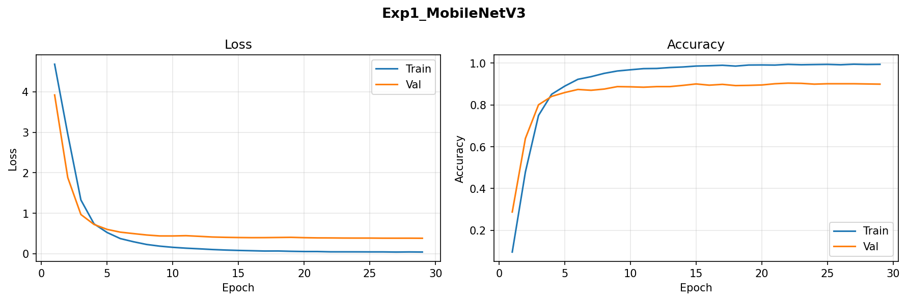
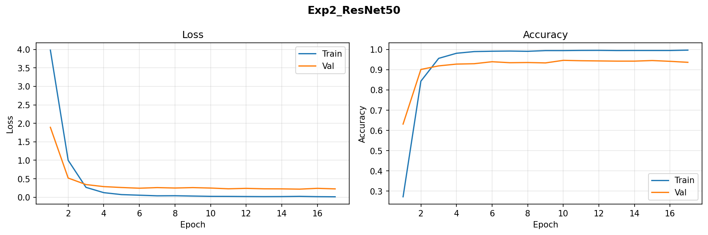
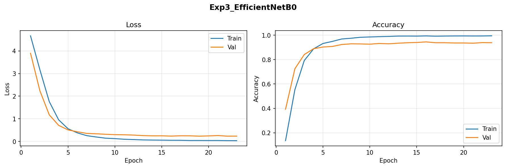
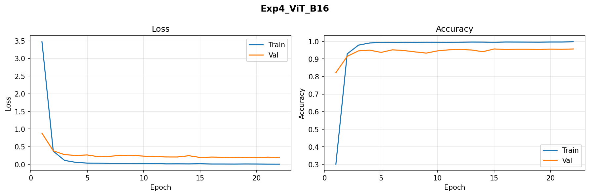
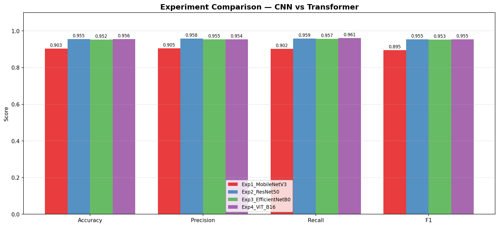
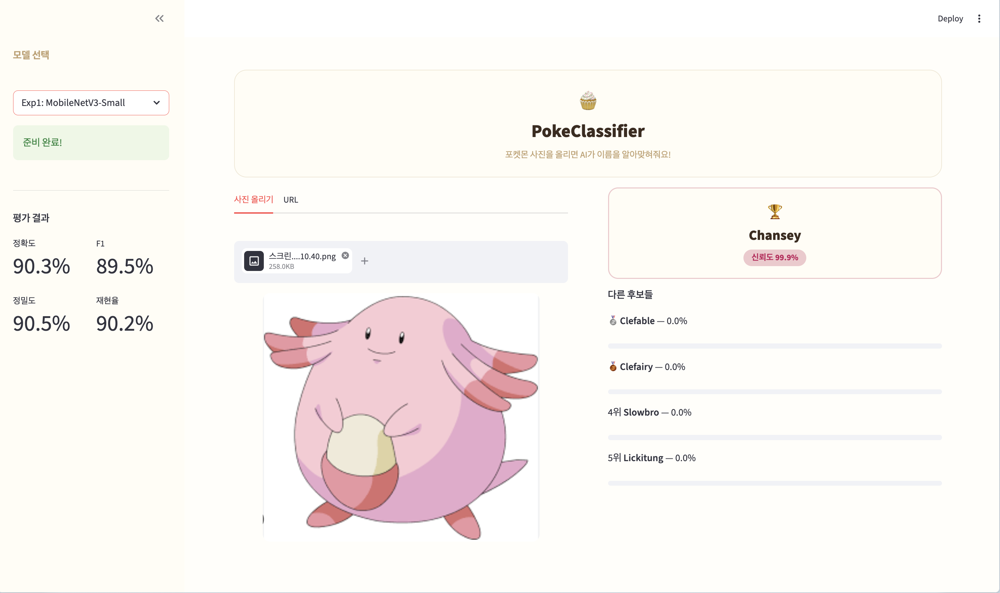
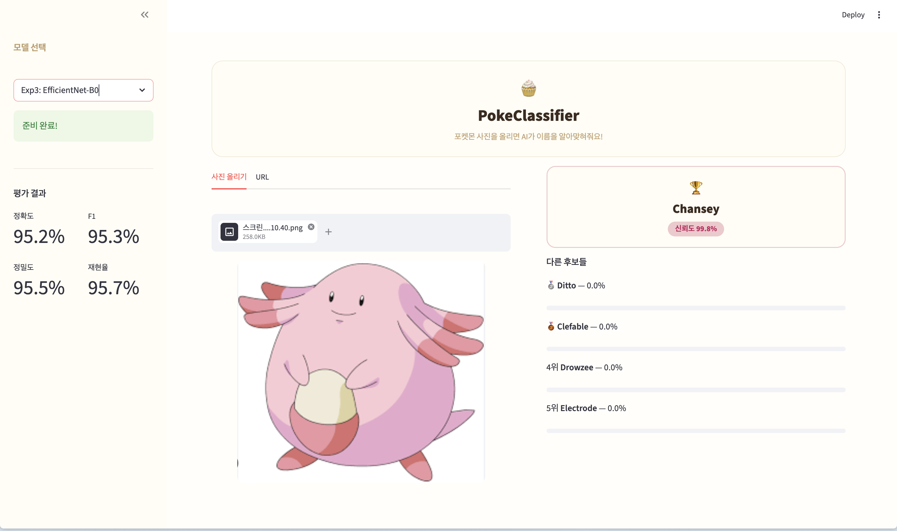
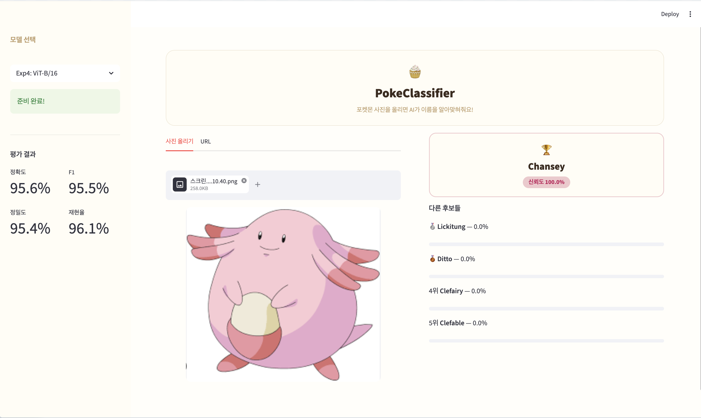
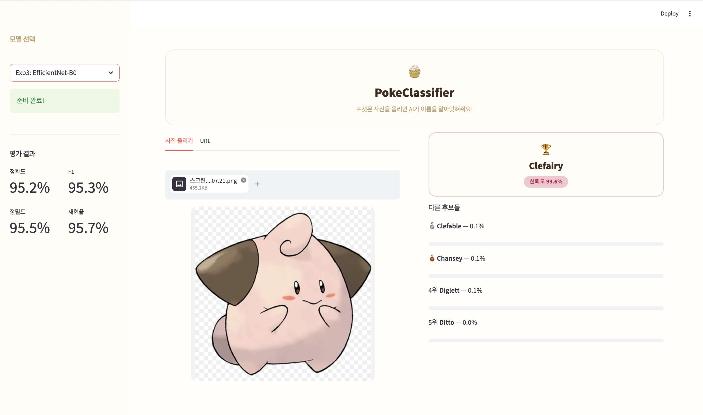
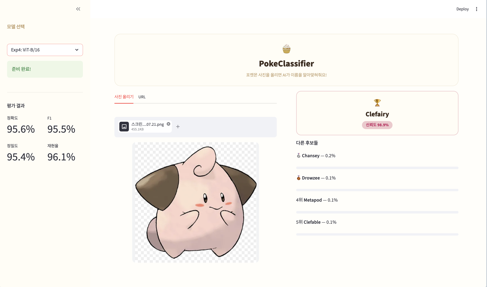

# 🧁 PokePeek — 전이학습 기반 포켓몬 이미지 분류기

포켓몬 이미지를 입력하면 AI가 포켓몬의 이름을 맞추는 이미지 분류기입니다.  
ImageNet 사전학습 모델을 활용한 전이학습(Transfer Learning)으로 150종의 포켓몬을 분류합니다.

---

## 연구 목표

**"소규모 데이터셋(~7,000장)에서 CNN과 Vision Transformer의 성능을 비교한다"**

모든 실험은 ImageNet 사전학습 가중치 + 전체 fine-tuning으로 통일하여  
**backbone 아키텍처 자체의 성능 차이**를 공정하게 비교합니다.

| 실험 | 모델 | 특징 | 파라미터 수 |
|---|---|---|---|
| Exp1 | MobileNetV3-Small | 경량 CNN | 1.7M |
| Exp2 | ResNet-50 | 검증된 중형 CNN | 23.8M |
| Exp3 | EfficientNet-B0 | Compound Scaling CNN | 4.2M |
| Exp4 | ViT-B/16 | Vision Transformer | 85.9M |

---

## 실험 결과

| 실험 | 정확도 | 정밀도 | 재현율 | F1 |
|---|---|---|---|---|
| Exp1: MobileNetV3-Small | 90.32% | 90.49% | 90.25% | 89.51% |
| Exp2: ResNet-50 | 95.50% | 95.79% | 95.89% | 95.47% |
| Exp3: EfficientNet-B0 | 95.21% | 95.45% | 95.72% | 95.27% |
| **Exp4: ViT-B/16** | **95.60%** | **95.40%** | **96.10%** | **95.45%** |

### 분석

- **ViT-B/16**이 정확도 95.60%로 가장 높은 성능을 기록했습니다.
- **ResNet-50**과 **EfficientNet-B0**은 비슷한 성능(~95.3%)을 보였습니다.
- **MobileNetV3**는 파라미터가 가장 적음에도 90.32%의 준수한 성능을 달성했습니다.
- EfficientNet-B0은 ResNet-50 대비 파라미터가 1/6 수준이지만 비슷한 성능을 보여 **효율성이 뛰어남**을 확인했습니다.

### 학습 곡선

| Exp1 MobileNetV3 | Exp2 ResNet-50 |
|---|---|
|  |  |

| Exp3 EfficientNet-B0 | Exp4 ViT-B/16 |
|---|---|
|  |  |

### 실험 비교 차트



---

##  데모

| MobileNetV3 | ResNet-50 |
|---|---|
|  |  |

| EfficientNet-B0 | ViT-B/16 |
|---|---|
|  |  |

| Exp1 MobileNetV3 | Exp2 ResNet-50 |
|---|---|
|  |  |

| Exp3 EfficientNet-B0 | Exp4 ViT-B/16 |
|---|---|
|  |  |


```bash
streamlit run demo_app.py
```

포켓몬 이미지를 업로드하면 Top-5 예측 결과와 신뢰도를 확인할 수 있습니다.

UI 디자인은 포켓몬 마휘핑(Milcery) 에서 영감을 받아
크림색 베이스에 분홍 포인트 컬러로 구성했습니다.

---

## 실행 방법

### 1. 패키지 설치

```bash
pip install torch torchvision timm streamlit scikit-learn matplotlib
```

### 2. 데이터셋 다운로드

```python
# Google Colab에서
import kagglehub
path = kagglehub.dataset_download("lantian773030/pokemonclassification")
```

### 3. 학습

```python
# pokemon_classifier_v2.py 실행
all_results, all_histories, class_names = main()
```

### 4. 데모 실행

```bash
streamlit run demo_app.py
```

---

## 학습 설정

| 항목 | 값 |
|---|---|
| 옵티마이저 | AdamW |
| 학습률 (CNN) | 1e-4 |
| 학습률 (ViT) | 2e-5 |
| 스케줄러 | Cosine Annealing |
| Weight Decay | 1e-4 |
| Early Stopping | patience=7 |
| 이미지 크기 | 224×224 |
| 데이터 증강 | RandomCrop, HorizontalFlip, ColorJitter |
| Train/Val/Test | 70% / 15% / 15% |

---

## 프로젝트 구조

```
pokemon-transfer-classifier/
├── pokemon_classifier_v2.py   # 메인 학습 코드 (4가지 실험)
├── demo_app.py                # Streamlit 데모 앱
├── README.md
└── results/
    ├── class_names.json
    ├── comparison.png
    └── curves/
        ├── Exp1_MobileNetV3.png
        ├── Exp2_ResNet50.png
        ├── Exp3_EfficientNetB0.png
        └── Exp4_ViT_B16.png
```

---

## 데이터셋

[7,000 Labeled Pokemon](https://www.kaggle.com/datasets/lantian773030/pokemonclassification) — Kaggle  
150종 포켓몬, 클래스당 평균 약 47장